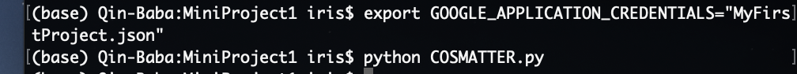
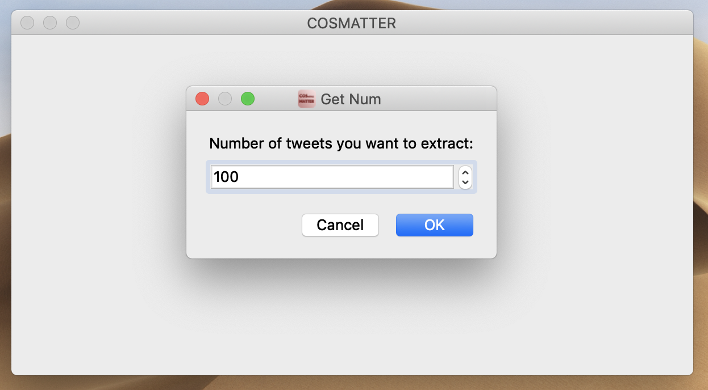
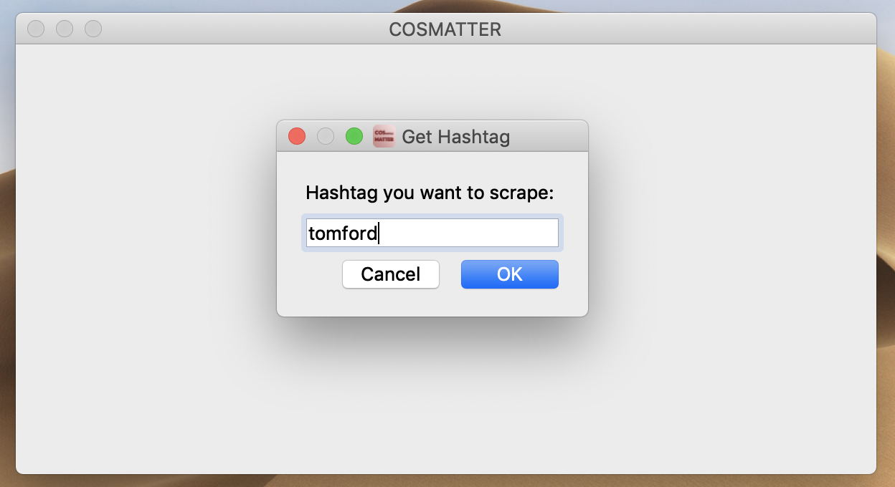
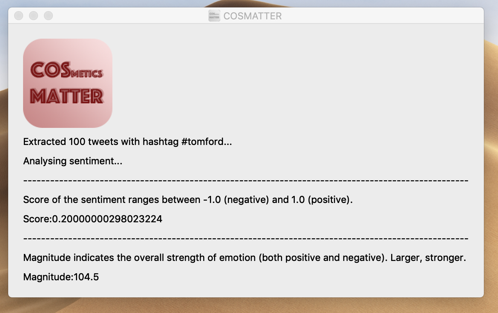

 
# COSMATTER      
Cosmetics matters! COSMATTER intends to provide fair assessments of cosmetics products to users via analysing sentiment in related postings on Twitter. As competent as an assistent, COSMATTER will present the most real, objective and valuable cosmetics comments to help users make right purchase decisions. It also help brand managers and salesmen do some effective improvment.

## User Stories
### Consumer
As a tyro in make-up, I can know a lot of information about cosmetics products from COSMATTER. By reading the contents on it, I can get a rough grasp on different cosmetics brands, and save a lot of money by avoiding unsuitable products. I can know about the popularity of each brand and make a decision to buy.

As a girl who likes making up, I can obtain just evalutions of cosmetics products and beauty brands from the COSMATTER, which really helps me in selecting items. 

As a man who know few about cosmetics, I can always pick out proper cosmetics gift for my girlfriend thanks to the suggestions on COSMATTER.

As a influencer, I can obtain the popularity information of cosmetics products, and this also gives me some video inspirations.

As a make-up artist, I can obtain the evaluations of cosmetics products and use different items for different people based on their skin situations.

### Brand side
As a brand image staff, I can get to know the true brand status among customers from COSMATTER, and try to make some enhancement depends on that.

As a brand production staff, I can obtaion direct product feedback from COSMATTER, and know customers' using experience and make effort in improving formulation.

As a propaganda department in a company, I can get the points that customers most care about, then make sure the publicity focus and do some advertisement.
 

### Salesmen 
As a warehouse of a shopping mall, I can get the information of which brand is the most popular and I can select some products to stock.

As a counter sales, I can get some attributes of products and do suitable introductions. I can get the feedback from customers and work well on selling.

### Supervisor
As a quality supervisor, I can get the feedback directly from COSMATTER, and find some potential quality issues.

## Architecture

## Instruction
The main file is COSMATTER.py, and make sure you have extract_tweet.py, sentiment_text_analysis.py and MyFirstProject.json in the same folder with the main file.

If all goes well, you just need to open the terminal in the current directory and type in "export GOOGLE_APPLICATION_CREDENTIALS="MyFirstProject.json"" first, and then "python COSMATTER.py", like this:

A window like this will pop up, asking about the number of tweets you want to extract. In this example, we type in 100:

Then another window will pop up, asking about the Hashtag you want to scrape. In this case, we type in tomford:

Allowing a few seconds to process and you will see the result like this:

Feel free to try on different cosmetics brands :)
Users can know if this brand is popular and the degree of popularity.

## Interface
[PyQt5](https://pypi.org/project/PyQt5/)

We choose to use PyQt5 to build a simple interface. PyQt5 is easy to learn and mutifunctional.

## APIs
[Twitter APIs](https://dev.twitter.com/)

After passing the Twitter APIs application, we get the keys to access to Twitter. Before we can actually use Twitter APIs, we need to first create an app as part of their OAuth authorization scheme, then set up a development environment for the endpoint. There are many libraries which Twitter provided that support the standard Twitter API. We prefer Tweepy for its convenience and multifunction.

[Tweepy](http://www.tweepy.org/)

After installing Tweepy, we just need to create an api object and well use it to obtain the related tweets we want. In this case, we use Tweepy's Cursor to crawl down tweets with specific cosmetics hashtag keyword， and aggregate them in a .txt file waiting for furthrt analysis.

[Google Natural Language APIs](https://cloud.google.com/natural-language/)

Our goal of this app is to get the sentiment from texts(conments from Twitter), so we use the analysissentiment function. In this function, we transmit a string parameter to the function, then it will be decoded and analysised by analysissentiment function. Steps are shown as follow:

First, we should create a google cloud account. We have a project and I am the owner of this project. Then download json file from Google cloud to the computer and get the key.

Second, set the environment before running the program. use "export GOOGLE_APPLICATION_CREDENTIALS=[PATH of json file]".

Third, use data from Twitter as the parameter as the program and analysis them. Finally, we get the result: score and magnitude.

The program use client.analyze_sentiment() function to analyse the sentiment to send the request and anayse the document by using request.document_sentiment.

For example, we want to check Becca's popularity:

We can get two results: score and magnitude.
Documentsentiment includes whole sentiment of a document, it has two indexes. Score is from -1 to 1. -1 represents negative and 1 represents positive, which shows the sentiment orientation. Magnitude represents the intensity of this sentiment.

In this example, score = 0.4 and magnitude = 88 Compared with other brands, the sentiment is obvious positive. So Becca has high popularity.

## Lessons learned

### What you liked doing? 
We like to do the programming for using API and write the front-end interface. We feel so excited when we extract the data and get the results of analyzing the data. After finishing the design of interface, we learnt how to write the front-end by python, which is a new skill.

### What you could have done better?
For analysing by google API, we can classify the different sentiments and do a more clear degree analysis, which is more user-friendly for users. In addition, we can write a judging function and decide if this brand should be bought and tell customers a direct result, for example, buy or not. If we do this, there will be different but suitable results for different users.

### What you will avoid in the future?
First, if we use the large API request, the security and convenience are very important, we should upgraded the time to optimize the API requests. Second, ports of API should have good readability and scalability, or leave some interface functions for future.
